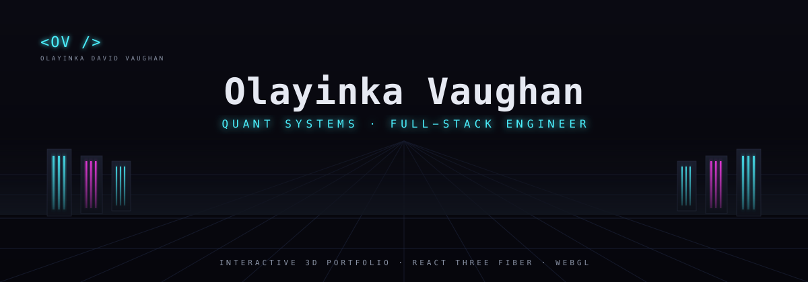
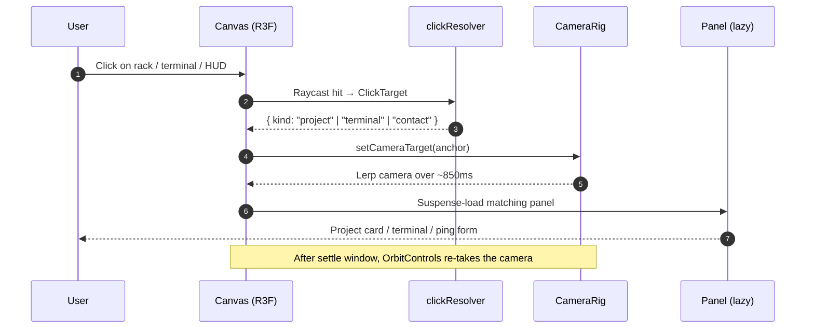

<picture>
  <source media="(prefers-color-scheme: dark)"  srcset="assets/banner-dark.png">
  <source media="(prefers-color-scheme: light)" srcset="assets/banner-light.png">
  
</picture>

[](https://github.com/Builder106/builder106.github.io/actions/workflows/deploy.yml)
[](https://www.typescriptlang.org/)
[](https://react.dev/)
[](https://threejs.org/)
[](#license)
[](https://yinkavaughan.me/)

A first-person tour through a neon server room, where each rack is one of my projects. Click a rack to dive into a project card; click the desk terminal to open a live trading dashboard. Built with React Three Fiber, animated with shaders, deployed continuously to GitHub Pages.

Live at **[yinkavaughan.me](https://yinkavaughan.me/)**.

## Demo

<details open>
<summary>~2 min walkthrough — open the room, dive into a project, pull up the terminal, send a ping</summary>


</details>

Recorded with a Playwright BDD demo suite (`npm run demo:record`). The recording infrastructure (custom reporter, cursor injection, animation freeze, dwell helper) lives in [e2e/demo/](e2e/demo/) — see [CONTRIBUTING.md](CONTRIBUTING.md#demo-videos) for the rationale.

## How it works

The portfolio renders as a single WebGL canvas. Clicks raycast into the scene, resolve to a known anchor (a rack, the terminal, the ping button), and steer the camera rig toward that anchor while the matching panel hydrates and slides in. After a short transition window the rig releases control back to OrbitControls so you can freely orbit, pan, and zoom.



The scene itself is authored in Blender (`blend/`), exported to glTF, and loaded once at boot. Each project's `id` matches a Blender Empty named `anchor_<id>`, which the runtime resolves to a world-space transform — that contract is documented in [docs/blender-contract.md](docs/blender-contract.md). Project metadata lives in [src/data/projects.ts](src/data/projects.ts); adding a new rack means adding an entry there and a matching `anchor_<id>` Empty in the scene.

Public repo stats (stars, last push, primary language) are baked at build time by [scripts/fetch-repo-stats.mjs](scripts/fetch-repo-stats.mjs), so the trading terminal stays fresh without a runtime API call.

## Stack

- **React 18** + **TypeScript 5** + **Vite 5**
- **react-three-fiber** + **drei** for the scene graph
- **three.js 0.170** for rendering, custom GLSL shaders for the holographic terminal swarm
- **Blender** for scene authoring, glTF for the runtime contract
- **GitHub Actions** → **GitHub Pages** for CI/CD

## Getting started

```bash
git clone https://github.com/Builder106/builder106.github.io.git
cd builder106.github.io
npm install
npm run dev
```

| Command | What it does |
|---|---|
| `npm run dev` | Vite dev server at `localhost:5173` |
| `npm run build` | Type-check, refresh repo stats, build to `dist/` |
| `npm run typecheck` | `tsc -b --noEmit` |
| `npm run preview` | Serve the production build locally |
| `npm run refresh-stats` | Re-fetch GitHub repo stats (requires `GH_TOKEN`) |

See [CONTRIBUTING.md](CONTRIBUTING.md) for project conventions and the scope of changes welcomed via PR.

## License

[MIT](LICENSE). The code is yours to learn from and adapt; the visual identity, project copy, and personal content remain mine — please don't fork-and-rebrand as your own portfolio.
