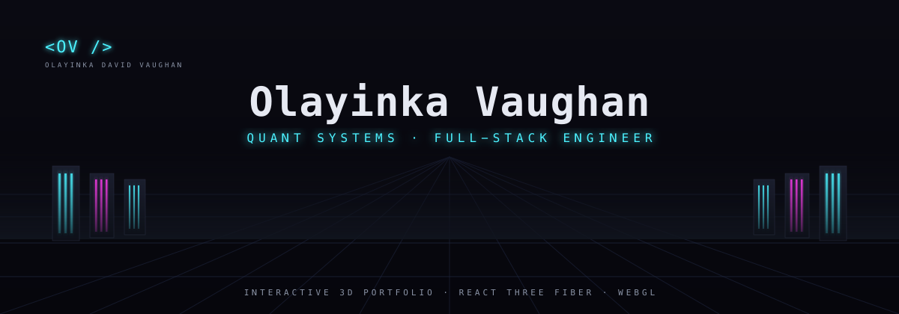
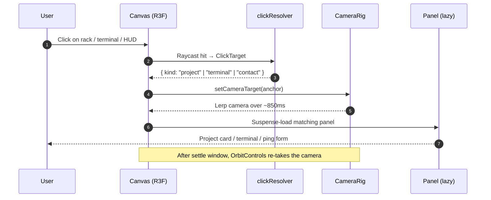

<picture>
  <source media="(prefers-color-scheme: dark)"  srcset="assets/banner-dark.png">
  <source media="(prefers-color-scheme: light)" srcset="assets/banner-light.png">
  
</picture>

[](https://github.com/Builder106/builder106.github.io/actions/workflows/deploy.yml)
[](https://www.typescriptlang.org/)
[](https://react.dev/)
[](https://threejs.org/)
[](#license)
[](https://yinkavaughan.me/)

> **Interactive 3D developer portfolio and project showcase.** Explore engineering projects as server racks inside a cybernetic 3D room.

## 💡 What is this Portfolio?

Instead of a flat webpage, this portfolio is an interactive 3D virtual environment built in WebGL. Visitors navigate through a stylized server room where each physical rack represents a real software project. Clicking any server rack flies the camera directly to that project's architecture breakdown, live demo link, and metrics.

**Live site:** [yinkavaughan.me](https://yinkavaughan.me/)

## Demo

<details open>
<summary>Interactive walkthrough: explore the 3D server room, inspect project racks, and interact with the terminal</summary>


The narrated walkthrough ([yinkavaughan.me/demo.mp4](https://yinkavaughan.me/demo.mp4)) explains the architecture and interactive features.

</details>

Recorded with a Playwright BDD demo suite (`npm run demo:record`). The recording infrastructure (custom reporter, cursor injection, animation freeze, dwell helper) lives in [e2e/demo/](e2e/demo/) — see [CONTRIBUTING.md](CONTRIBUTING.md#demo-videos) for the rationale.

## How it works

The portfolio renders as a single WebGL canvas. Clicks raycast into the scene, resolve to a known anchor (a rack, the terminal, the ping button), and steer the camera rig toward that anchor while the matching panel hydrates and slides in. After a short transition window the rig releases control back to OrbitControls so you can freely orbit, pan, and zoom.


```mermaid
sequenceDiagram
    autonumber
    participant U as User
    participant C as Canvas (R3F)
    participant R as clickResolver
    participant Rig as CameraRig
    participant P as Panel (lazy)
    U->>C: Click on rack / terminal / HUD
    C->>R: Raycast hit → ClickTarget
    R-->>C: { kind: "project" | "terminal" | "contact" }
    C->>Rig: setCameraTarget(anchor)
    Rig-->>C: Lerp camera over ~850ms
    C->>P: Suspense-load matching panel
    P-->>U: Project card / terminal / ping form
    Note over Rig,C: After settle window, OrbitControls re-takes the camera
```

The scene itself is authored in Blender (`blend/`), exported to glTF, and loaded once at startup. Each project's `id` matches an empty Blender object named `anchor_<id>`, which the runtime resolves to a 3D coordinate (documented in [docs/blender-contract.md](docs/blender-contract.md)). Project metadata lives in [src/data/projects.ts](src/data/projects.ts); adding a new rack requires adding an entry there and a matching anchor in the 3D scene.

Public repository stats (stars, latest updates, language distribution) are generated at build time by [scripts/fetch-repo-stats.mjs](scripts/fetch-repo-stats.mjs) to keep performance fast.

## Subprojects

- **[OSS Ledger](oss-contribution-tracker/)**: A standalone dashboard tracking open-source contributions toward GSoC 2027, updated via automated scripts and deployed alongside the portfolio at [yinkavaughan.me/oss-contribution-tracker/](https://yinkavaughan.me/oss-contribution-tracker/).
- **[Multi-Resume Kit](multi-resume-kit/)**: A modular LaTeX resume framework for maintaining synchronized role-targeted resumes across digital, print, and ATS formats from shared source files. Live preview: [yinkavaughan.me/multi-resume-kit/](https://yinkavaughan.me/multi-resume-kit/).

## Tech Stack

- **React 18, TypeScript 5, Vite 5**
- **React Three Fiber & Drei** for 3D scene management
- **Three.js** for WebGL rendering with custom GLSL shader effects
- **Blender** for 3D room modeling and glTF scene export
- **GitHub Actions & GitHub Pages** for continuous deployment

## Getting Started

```bash
git clone https://github.com/Builder106/builder106.github.io.git
cd builder106.github.io
npm install
npm run dev
```

| Command | What it does |
| --- | --- |
| `npm run dev` | Local development server at `localhost:5173` |
| `npm run build` | Type-check, refresh project stats, build to `dist/` |
| `npm run typecheck` | TypeScript verification (`tsc -b --noEmit`) |
| `npm run preview` | Serve production build locally |
| `npm run refresh-stats` | Refresh GitHub repository statistics |

See [CONTRIBUTING.md](CONTRIBUTING.md) for contribution guidelines.

## License

MIT (see [LICENSE](LICENSE)). The source code is open for reference and adaptation. Portfolio copy and personal branding remain copyrighted.
